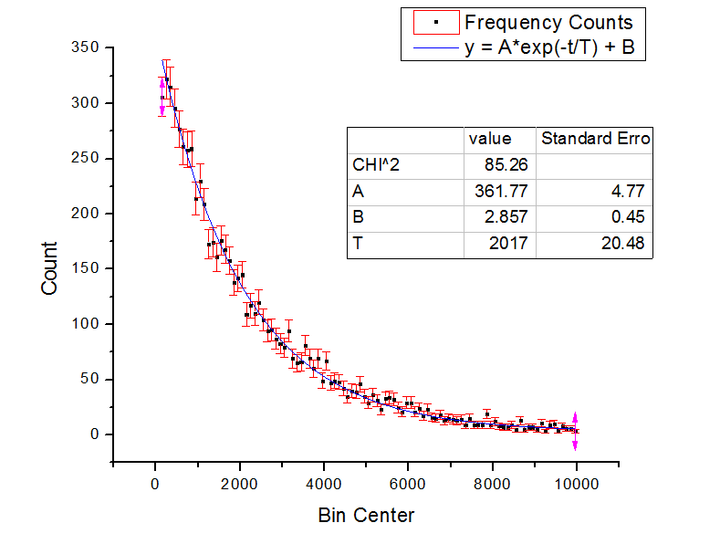

# muon
Measuring the lifetime of atmospheric muons

By capturing atmospheric muons through a crystal scintillator and analyzing the data collected via an FPGS, it is possible to measure the lifetime of the particle. 

The complete document can be viewed under MuonExperiment.pdf

